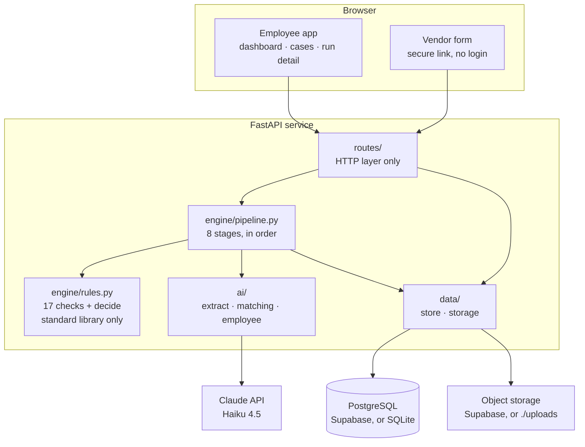

# Vendor Onboarding Decision Engine

A vendor submission goes in. An explained decision comes out.

Before a company can pay a vendor, someone has to verify the vendor is genuine:
collect company details, banking information, tax registration and compliance
documents, then check all of it is complete, consistent and credible. That
review is manual, chasing missing information is manual, and the only record of
why a vendor was approved is somebody's inbox.

The expensive failure is not an incomplete form. It is a submission that *looks*
complete and quietly contradicts itself — a bank account in a different name, a
tax ID that disagrees with the declared legal form. Those pass a completeness
check and cause payment fraud.

This application collects a form and five documents, and returns
**Approved**, **Pending** or **Rejected** with every reason visible, the
evidence beside it, and an append-only record of how the decision was reached.

> **AI reads the evidence. Deterministic rules validate it. A policy decides.**

For a non-technical walkthrough, see
[docs/SOLUTION-OVERVIEW.md](docs/SOLUTION-OVERVIEW.md).

---

## Architecture



The grouping is the dependency rule made visible: `routes → engine → data`,
never backwards. It is enforced by tests rather than convention — no SQL outside
`data/store.py`, no database driver in `routes/`, and `engine/rules.py` imports
nothing outside the standard library, so it *cannot* reach a model even by
accident.

| Piece | Choice |
| --- | --- |
| API | FastAPI, one router per domain, all under `/api` |
| Frontend | React 18 + Vite, responsive from 320px up |
| Database | Supabase Postgres, or SQLite when `DATABASE_URL` is unset |
| Storage | Supabase Storage, or `./uploads` when the keys are unset |
| AI | Anthropic SDK, native PDF input, structured outputs |
| Auth | One shared password → HMAC-signed session token (stdlib only) |

---

## How a submission is processed

An employee creates a **case** and gets one secure link. The vendor fills in the
form, attaches five documents and submits. That creates a **run**, which
executes eight stages in order:

| # | Stage | Does | AI |
| --- | --- | --- | --- |
| 1 | Submission received | Records what arrived, validates each file | — |
| 2 | Checking completeness | Required fields and documents present | — |
| 3 | Extracting documents | Reads each document into structured fields | **yes** |
| 4 | Validating formats | Identifiers well-formed, document is what it claims | — |
| 5 | Cross-checking | Form vs documents, and documents vs each other | only for ambiguous names |
| 6 | Decision | Findings become a status | — |
| 7 | Assistant review | Plain-English briefing for the reviewer | **yes** |
| 8 | Preparing communication | Correction list, or an internal note | — |

Two orderings are deliberate. **Completeness runs before extraction** — telling
a vendor they forgot an attachment should not wait on five model calls. **The
review runs after the decision** — the status is persisted first, so a slow or
wrong model cannot change or delay it.

A **case** is the vendor's onboarding journey; a **run** is one submission
through the pipeline. A correction adds a run rather than replacing one, so
previous evidence, findings and timings survive.

---

## The decision

**17 checks**, grouped by what they protect: completeness, document integrity,
identifier validity, identity and tax consistency, banking consistency, address
consistency. Each has a stable id, a stated purpose, and evidence attached to
whatever it finds. Every check reports **passed / failed / not applicable**, so
a check correctly skipped is never counted as one that passed.

Findings carry one of two severities, and the whole design hangs off the
difference:

- **FIX** — something is missing or unclear. The vendor can correct it.
- **BLOCK** — the evidence contradicts the submission. Not a typo.

```python
def decide(findings):
    if any(f.severity == BLOCK for f in findings): return "REJECTED"
    if any(f.severity == FIX   for f in findings): return "PENDING"
    return "APPROVED"
```

That is the entire decision layer. It sees findings and nothing else — not the
vendor, not the documents, not the model output, not the clock. A pipeline
failure is **ERROR**, never REJECTED: "our extraction failed" and "this vendor
is not credible" are different facts.

Checks worth knowing about: the **GSTIN mod-36 checksum** catches a number that
was invented rather than issued; the **PAN's 4th character** encodes legal form,
so a firm's PAN on a submission claiming a proprietorship is a contradiction;
and the **PAN embedded in a GSTIN** catches a certificate belonging to a
different legal person — all with no external lookup.

Full table: [docs/03-validation-rules.md](docs/03-validation-rules.md).

---

## Where AI is used, and where it is not

Three scoped model calls on `claude-haiku-4-5`.

| Call | Does | Can it set the status? |
| --- | --- | --- |
| `ai/extract.py` | Reads each document into structured JSON | No — the rules judge what it read |
| `ai/matching.py` | Compares two entity names, **only** in the ambiguous band | No — it answers one question |
| `ai/employee.py` | Risk narrative, key points, recommended action | No — it runs after `decide()` |

Extraction is deliberately **transcription**: the prompt forbids inferring,
correcting or completing anything, and an honest `null` is always preferred to a
plausible guess — because a guessed value would silently pass a check it should
fail.

Name matching is **three-valued**. At or above 0.92 similarity the names match;
at or below 0.75 they do not; only in between is a model asked, and if it comes
back under 70% confident the answer is *uncertain*, which becomes a question for
a human — never a rejection, and never a silent pass. Around nine in ten
comparisons never reach a model.

Risk level is arithmetic, not AI: `BLOCK → High, FIX → Medium, else Low`. The
model writes the rationale; it never sets the level.

---

## Screens

| Route | What it is |
| --- | --- |
| `/dashboard` | One row per case, with its current state |
| `/onboardings/new` | Create a case, pick its form, get the vendor link |
| `/onboardings/:id` | The case: contact, form, and its permanent vendor link |
| `/run/:id` | The run: the decision, why, the evidence, what to do next |
| `/forms` · `/forms/:id` | Configurable onboarding forms |
| `/vendor/onboard/:token` | The vendor's own form. No login, no internal data |

The run page leads with the decision in plain English and the check breakdown,
then the findings that caused it — each with rule id, category, severity, and
the two values that prove it, labelled by source:

```
R09 · Bank account holder is the vendor          BLOCK   Banking consistency
Bank account is held in a different name than the vendor entity.

  Cancelled cheque or bank letter    S. Balan
  Vendor submission                  Ashwin Chemicals Private Limited
```

The full check register, extracted-vs-submitted per document, the AI briefing,
the timeline and the audit trail are all present and folded away below.

---

## Running it

```bash
cp .env.example .env          # set ANTHROPIC_API_KEY and APP_PASSWORD
pip install -r requirements-dev.txt
cd frontend && npm install && npm run build && cd ..
python -m uvicorn app:app --reload --app-dir backend --port 8000
```

Open <http://localhost:8000>. With `DATABASE_URL` and the Supabase keys unset it
runs on SQLite and `./uploads`. For frontend work, `npm run dev` on `:5173`
proxies to the API.

| Variable | Required | Notes |
| --- | --- | --- |
| `ANTHROPIC_API_KEY` | yes | Extraction and the AI review |
| `APP_PASSWORD` | yes | The shared password. The app refuses to start without it |
| `DATABASE_URL` | deployment | Supabase Postgres — use the **session pooler** URI |
| `SUPABASE_URL` | deployment | |
| `SUPABASE_SERVICE_ROLE_KEY` | deployment | The **secret** key; a publishable key cannot write to a private bucket |
| `SUPABASE_BUCKET` | deployment | Defaults to `onboarding-documents` |

## Tests

```bash
python -m pytest -q      # 563
cd frontend && npm test  # 129
```

No network and no mocking of the database: real SQLite, a real FastAPI client,
real session tokens. Several tests assert *architecture* rather than behaviour,
which is what keeps the design from drifting — `engine/rules.py` stays
stdlib-only, no rule reads the wall clock, no SQL escapes `data/store.py`, and
nothing reachable over HTTP can delete a run, a finding or an audit event.

## Demo material

`case_demo/` holds six prepared submissions — one clean, five edge cases — each
with a plain-text input sheet and realistic generated documents (a PAN card,
Form GST REG-06, an MCA certificate, a bank letter, a state electricity bill).

```bash
python case_demo/verify_cases.py    # runs all six through the real engine
```

## Deploying

`vercel.json` builds the frontend and rewrites every path to one serverless
function at `api/index.py`, which re-exports the same ASGI app `uvicorn` runs
locally. One origin, one deployment, no CORS in production.

Two settings there are load-bearing. **`maxDuration`** — the pipeline runs
inside the request and a full run takes around fifty seconds, so the 10-second
default would abort every real submission; `300` requires Pro, and Hobby caps at
60s. **`includeFiles`** — the Python builder only bundles files under the
entrypoint's tree, so the React bundle has to be named explicitly.

## Known limits

- **No external verification.** Every check is internal consistency — no
  registry, sanctions or bank-account lookup. That is why it needs no external
  service and can explain itself completely.
- **Nothing is sent automatically.** The engine prepares exactly what to ask the
  vendor for; a person sends it and reopens the form.
- **India-depth.** The cross-document identity checks are India-specific, and
  the standard form assumes an Indian vendor.
- **One shared password.** The audit trail records the action, not which person
  took it.
- **Long numbers on photographed documents can be misread**, which can produce a
  false rejection. Digital PDFs and clean scans read reliably, and an unreadable
  document fails safely into a request for a clearer copy.

Full list: [docs/10-assumptions-and-scope.md](docs/10-assumptions-and-scope.md).

## Documentation

| | |
| --- | --- |
| [Solution overview](docs/SOLUTION-OVERVIEW.md) | Non-technical, 5-minute read |
| [01](docs/01-solution-overview.md) | The process, end to end |
| [02](docs/02-data-model.md) | Submission shape, tables, events |
| [03](docs/03-validation-rules.md) | All 17 checks and their impact |
| [04](docs/04-decision-engine.md) | Severity, precedence, why AI cannot decide |
| [05](docs/05-ai-design.md) | Where AI is used, prompts, model choice |
| [07](docs/07-architecture.md) | Modules, boundaries, request flow |
| [10](docs/10-assumptions-and-scope.md) | Assumptions, scope, security posture |
| [13](docs/13-deployment-plan.md) | Supabase and Vercel |
| [16](docs/16-frontend.md) | The React app |
